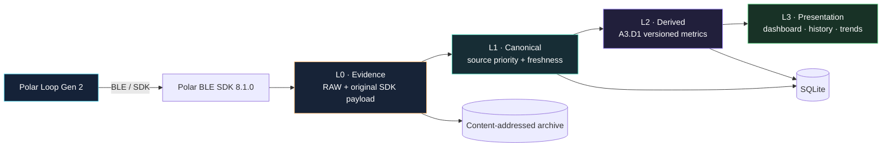

<div align="center">
  

  <br/>

  **把 Polar Loop Gen 2 的设备数据，变成可验证、可追溯、可长期保留的本地健康数据。**

  *A privacy-first local health data bridge and research platform for Polar Loop Gen 2.*

  
  
  
  
  
  
</div>

---

## What is JOJI?

**JOJI Polar Bridge** 是一个面向 **Polar Loop Gen 2** 的 Android 本地数据桥与研究平台。项目的重点不是“做另一个同步界面”，而是建立一个能够长期演进的数据层：

- 通过官方 **Polar BLE SDK 8.1.0** 获取可公开调用的活动、心率、PPI、睡眠、Nightly Recharge、皮温等数据；
- 对经过审计白名单允许的设备文件做只读归档，并用 SHA-256 建立内容寻址历史；
- 将 SDK 原始语义记录、RAW 文件和 Joji 自己计算的 Derived 指标严格分层；
- 在重复同步中识别 **真正变化的数据** 与 **完全重复的数据**；
- 保留算法版本和 source fingerprint，使历史结果可以重新计算、比较和追溯；
- 对连接、权限边界和失败恢复保留完整 evidence，而不是隐藏异常。

> This repository is an independent research project and is **not affiliated with or endorsed by Polar Electro**.

## Current milestone — V5-A3

当前稳定里程碑为 **V5-A3 / A3.D1**。

| Area | Status | Notes |
|---|---:|---|
| Windows Android build | ✅ PASS | Kotlin compile, unit tests, lint, assemble, safety/privacy gates |
| Local persistence | ✅ PASS | SQLite + app-private RAW archive |
| Schema migration | ✅ PASS | explicit `v1 → v2` migration |
| Incremental sync / dedup | ✅ PASS | logical-key + payload SHA-256 |
| Derived versioning | ✅ PASS | algorithm version + source fingerprint |
| Manual recompute idempotency | ✅ PASS | unchanged inputs produce duplicates, not new rows |
| Safe release | ✅ PASS | successful sessions end with callback-confirmed disconnect |
| Persistent device writes | **0** | mutation APIs remain forbidden |
| Known transient | ⚠️ tracked | RAW inventory protobuf parse can fail transiently |

Latest sealed APK SHA-256:

```text
b978ed1ceade315586b6c298eefa66b2912d677292af47021dcc3d33141672c7
```

## Architecture



### Four-layer data model

1. **L0 Evidence** — immutable RAW artifacts and original SDK payloads.
2. **L1 Canonical** — normalized records with explicit source authority and freshness.
3. **L2 Derived** — transparent, recomputable Joji metrics; never overwrites source data.
4. **L3 Presentation** — dashboard, health views, history and trends.

This separation is deliberate: **derived values are never treated as raw truth.**

## Real-device validation highlights

A3 real-device evidence has validated two important properties:

### 1. Recompute is idempotent

An initial A3.D1 recompute created four derived records. Repeating manual recompute against unchanged source data produced:

```text
new=0
duplicate=4
```

### 2. Changed source data creates a new version

After a later successful sync changed part of the underlying dataset, A3.D1 produced:

```text
new=1
duplicate=3
```

That is the intended versioning model: **change creates history; no-change stays deduplicated.**

## Supported semantic domains

Current real-device work covers:

- Steps
- Activity samples
- Daily summary
- Active time
- Distance
- Calories
- 24/7 heart rate
- 24/7 PPI
- Sleep
- Nightly Recharge
- Skin temperature
- Training references / sessions (empty is treated as a valid current state)
- SpO₂ tests (empty is treated as a valid current state)

More detail: [`docs/ARCHITECTURE.md`](docs/ARCHITECTURE.md)

## Safety model

JOJI intentionally keeps a narrow device-side safety boundary.

**Allowed**

- reuse the existing Android BLE bond;
- read supported SDK health/history APIs;
- start/stop approved online PMD streams;
- perform reviewed read-only file retrieval through the existing whitelist;
- archive and process data locally.

**Forbidden by project policy**

- `readFile` executable use;
- file write/delete operations;
- log configuration mutation;
- bond creation/removal;
- factory reset / firmware operations;
- SDK mode activation;
- offline-recording mutation;
- ECG start;
- persistent device mutation.

See [`docs/SAFETY.md`](docs/SAFETY.md).

## Research findings

The project has also investigated device-side data lifecycles and Polar Flow interaction. One important observation is that different device datasets appear to have different lifecycles: some HR/PPI/AUTOS/sleep-intermediate data behaves like rolling or consumable sync queues, while activity summaries and history indexes behave differently.

These findings are treated as **evidence-backed research hypotheses**, not undocumented vendor guarantees.

See [`docs/RESEARCH.md`](docs/RESEARCH.md).

## Roadmap

```text
V5-A3   ✅ Versioned derived layer + local research index
  ↓
V5-B1   ◉ RAW inventory resilience + differential research index
  ↓
V5-B    ○ 7 / 30 / 90-day analytics + personal baseline
  ↓
V5-C    ○ explainable baseline alerts / health intelligence
```

Next focus: make RAW inventory failure **stage-isolated and recoverable**, then correlate changing RAW paths with semantic changes instead of blindly expanding file access.

See [`docs/ROADMAP.md`](docs/ROADMAP.md).

## Privacy

The public repository intentionally excludes:

- personal health export JSON;
- full live evidence logs;
- Bluetooth MAC addresses and device IDs;
- private handoff archives;
- app-private RAW payloads;
- user-specific sync history.

Public documentation contains only sanitized engineering facts and aggregated validation results.

## Repository status

This is an actively developed personal research project. The repository currently publishes the **architecture, validation model, safety policy and research roadmap**. Source publication can be staged separately after the private development tree is scrubbed and packaged for public release.

---

<div align="center">
  <sub>Built around evidence, reproducibility, and a strict no-device-mutation boundary.</sub>
</div>
