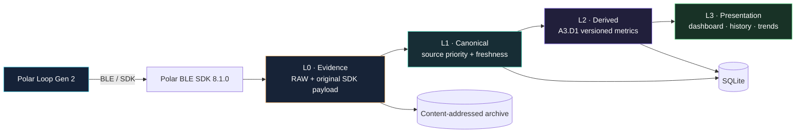

<!-- JOJI Polar Bridge V5-A3 — published 2026-08-10 -->
<div align="center">
  

  <br/>

  **Turn Polar Loop Gen 2 device data into verifiable, traceable, durable local health data.**

  *A privacy-first local health data bridge and research platform for Polar Loop Gen 2.*

  **English** · [简体中文](README_CN.md)

  
  
  
  
  
  
</div>

---

## What is JOJI?

**JOJI Polar Bridge** is an Android local data bridge and research platform for **Polar Loop Gen 2**. The goal is not to build another sync screen, but a durable data layer that can evolve without losing provenance:

- read supported activity, heart-rate, PPI, sleep, Nightly Recharge, skin-temperature and related data through **Polar BLE SDK 8.1.0**;
- archive reviewed read-only device artifacts with SHA-256 content identities;
- keep original SDK semantics, RAW artifacts and JOJI-derived metrics in separate layers;
- distinguish genuinely changed data from exact repeats during incremental sync;
- retain algorithm versions and source fingerprints so derived history can be recomputed and compared;
- preserve evidence for connection behavior, permission boundaries and recovery paths instead of hiding failures.

> [!IMPORTANT]
> This repository is an independent research project and is **not affiliated with or endorsed by Polar Electro**.

## Claim labels

Technical statements use explicit scope labels:

| Label | Meaning |
|---|---|
| **Verified** | Supported by this project's recorded build, test or real-device evidence for the stated scope. |
| **Observation** | Directly observed during experiments, but not treated as a vendor guarantee or universal behavior. |
| **Hypothesis** | A working interpretation that still requires additional controlled testing. |
| **Policy** | A JOJI-imposed engineering or safety rule; not a claim about Polar's requirements. |

See [`docs/RESEARCH.md`](docs/RESEARCH.md) for the research-specific annotations.

## Current milestone — V5-A3

**Verified — project validation scope:** V5-A3 / A3.D1 is the current sealed project milestone.

| Area | Status | Scope / notes |
|---|---:|---|
| Windows Android build | ✅ PASS | Kotlin compile, unit tests, lint, assemble, safety/privacy gates |
| Local persistence | ✅ PASS | SQLite + app-private RAW archive |
| Schema migration | ✅ PASS | explicit `v1 → v2` migration |
| Incremental sync / dedup | ✅ PASS | logical key + payload SHA-256 |
| Derived versioning | ✅ PASS | algorithm version + source fingerprint |
| Manual recompute idempotency | ✅ PASS | unchanged inputs deduplicate instead of creating new rows |
| Safe release | ✅ PASS | successful validated sessions end with callback-confirmed disconnect |
| Persistent device writes | **0** | mutation APIs remain forbidden by project policy |
| Known transient | ⚠️ tracked | RAW inventory protobuf parsing has failed transiently in recorded evidence |

Latest sealed APK SHA-256 recorded by the project:

```text
b978ed1ceade315586b6c298eefa66b2912d677292af47021dcc3d33141672c7
```

Detailed validation status: [`docs/BUILD_STATUS.md`](docs/BUILD_STATUS.md)

## Architecture



### Four-layer data model

1. **L0 Evidence** — immutable RAW artifacts and original SDK payloads.
2. **L1 Canonical** — normalized records with explicit source authority and freshness.
3. **L2 Derived** — transparent, recomputable JOJI metrics that never overwrite source data.
4. **L3 Presentation** — dashboard, health views, history and trends.

**Design rule:** derived values are never treated as raw truth.

More detail: [`docs/ARCHITECTURE.md`](docs/ARCHITECTURE.md)

## Real-device validation highlights

### Verified — recompute idempotency

Within the recorded A3 real-device validation set, an initial `A3.D1` recompute created four derived records. Repeating manual recompute against unchanged source data produced:

```text
new=0
duplicate=4
```

### Verified — changed source creates a new derived version

After a later successful sync changed part of the underlying dataset, the recorded A3.D1 recompute produced:

```text
new=1
duplicate=3
```

For this implementation and validation set, the intended rule holds: **change creates history; no-change stays deduplicated.**

## Supported semantic domains

Current project work includes:

- Steps
- Activity samples
- Daily summary
- Active time
- Distance
- Calories
- 24/7 heart rate
- 24/7 PPI
- Sleep
- Nightly Recharge
- Skin temperature
- Training references / sessions (an empty result is treated as a valid current state)
- SpO₂ tests (an empty result is treated as a valid current state)

## Safety model

**Policy:** JOJI intentionally keeps a narrow device-side safety boundary.

**Allowed by project policy**

- reuse the existing Android BLE bond;
- read supported SDK health/history APIs;
- start/stop approved online PMD streams;
- perform reviewed read-only file retrieval through the existing whitelist;
- archive and process retrieved data locally.

**Forbidden by project policy**

- executable use of SDK `readFile`;
- file write/delete operations;
- log-configuration mutation;
- bond creation/removal;
- factory reset or firmware operations;
- SDK-mode activation;
- offline-recording mutation;
- ECG start;
- persistent device mutation.

See [`docs/SAFETY.md`](docs/SAFETY.md).

## Research findings

**Observation:** differential experiments indicate that device-side datasets do not all follow the same lifecycle. In the current evidence set, some HR/PPI/AUTOS/sleep-intermediate artifacts changed or rolled across sync windows while activity summaries and history/index artifacts behaved differently.

**Hypothesis:** some of these datasets may behave like rolling or consumable sync queues. This remains a research interpretation, **not an undocumented vendor guarantee**.

See [`docs/RESEARCH.md`](docs/RESEARCH.md).

## Roadmap

```text
V5-A3   ✅ Versioned derived layer + local research index
  ↓
V5-B1   ◉ RAW inventory resilience + differential research index
  ↓
V5-B    ○ 7 / 30 / 90-day analytics + personal baseline
  ↓
V5-C    ○ explainable baseline alerts / health intelligence
```

Next focus: make RAW inventory failure **stage-isolated and recoverable**, then correlate changing RAW paths with semantic changes before considering any expansion of research scope.

See [`docs/ROADMAP.md`](docs/ROADMAP.md).

## Privacy

The public repository intentionally excludes:

- personal health export JSON;
- full live evidence logs;
- Bluetooth MAC addresses and device IDs;
- private handoff archives;
- app-private RAW payloads;
- user-specific sync history.

Public documentation contains sanitized engineering facts and aggregated validation results only.

## Repository status

This is an actively developed personal research project. The public repository currently publishes the **architecture, validation model, safety policy and research roadmap**. Application source code is not part of this public package at this stage.

---

<div align="center">
  <sub>Built around evidence, reproducibility, explicit claim scope, and a strict no-device-mutation boundary.</sub>
</div>
