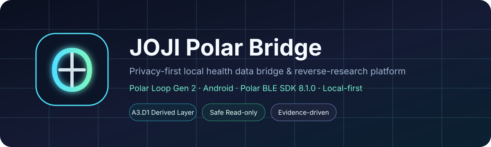
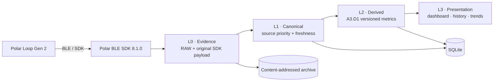

<!-- JOJI Polar Bridge V5-A3 — published 2026-08-10 -->
<div align="center">
  

  <br/>

  **把 Polar Loop Gen 2 的设备数据，变成可验证、可追溯、可长期保留的本地健康数据。**

  *面向 Polar Loop Gen 2 的隐私优先本地健康数据桥与研究平台。*

  [English](README.md) · **简体中文**

  
  
  
  
  
  
</div>

---

## JOJI 是什么？

**JOJI Polar Bridge** 是一个面向 **Polar Loop Gen 2** 的 Android 本地数据桥与研究平台。目标不是再做一个同步界面，而是建立一个长期可演进、同时保留数据来源与证据链的数据层：

- 通过 **Polar BLE SDK 8.1.0** 读取受支持的活动、心率、PPI、睡眠、Nightly Recharge、皮温等数据；
- 对经审核允许的只读设备文件进行归档，并用 SHA-256 建立内容身份；
- 将 SDK 原始语义、RAW 文件与 JOJI 自行计算的 Derived 指标严格分层；
- 在增量同步中区分真正发生变化的数据与完全重复的数据；
- 保留算法版本与 source fingerprint，使历史派生结果可重新计算和比较；
- 对连接行为、权限边界与恢复路径保留 evidence，而不是隐藏异常。

> [!IMPORTANT]
> 本仓库是独立研究项目，**与 Polar Electro 无隶属关系，也未获得其官方背书**。

## 内容批注 / 证据等级

仓库中的技术表述使用以下标签：

| 标签 | 含义 |
|---|---|
| **Verified / 已验证** | 在注明范围内，有本项目的构建、测试或实机证据支持。 |
| **Observation / 观察** | 在实验中直接观察到，但不等同于厂商保证或普遍规律。 |
| **Hypothesis / 假设** | 基于现有证据形成的工作解释，仍需更多受控实验验证。 |
| **Policy / 策略** | JOJI 自己设定的工程或安全边界，不代表 Polar 官方要求。 |

研究类内容的详细批注见 [`docs/RESEARCH_CN.md`](docs/RESEARCH_CN.md)。

## 当前里程碑 — V5-A3

**Verified / 已验证（仅限本项目验证范围）：** 当前封存里程碑为 **V5-A3 / A3.D1**。

| 项目 | 状态 | 范围 / 说明 |
|---|---:|---|
| Windows Android 构建 | ✅ PASS | Kotlin 编译、单元测试、lint、assemble、安全/隐私 gates |
| 本地持久化 | ✅ PASS | SQLite + 应用私有 RAW 归档 |
| Schema 迁移 | ✅ PASS | 显式 `v1 → v2` 迁移 |
| 增量同步 / 去重 | ✅ PASS | logical key + payload SHA-256 |
| Derived 版本化 | ✅ PASS | algorithm version + source fingerprint |
| 手动重算幂等性 | ✅ PASS | 输入未变时去重，不创建新记录 |
| 安全释放 | ✅ PASS | 已验证成功会话以 callback-confirmed disconnect 结束 |
| 持久设备写入 | **0** | 项目策略禁止 mutation API |
| 已知瞬态问题 | ⚠️ tracked | 实机 evidence 中出现过 RAW inventory protobuf 瞬时解析失败 |

项目记录的最新封存 APK SHA-256：

```text
b978ed1ceade315586b6c298eefa66b2912d677292af47021dcc3d33141672c7
```

详细验证状态：[`docs/BUILD_STATUS.md`](docs/BUILD_STATUS.md)

## 架构



四层数据模型：

1. **L0 Evidence** — 不可变 RAW 证据与原始 SDK payload。
2. **L1 Canonical** — 带明确来源优先级和 freshness 的规范化记录。
3. **L2 Derived** — 透明、可重算、带版本的 JOJI 派生指标，不覆盖源数据。
4. **L3 Presentation** — dashboard、健康视图、历史与趋势。

**设计原则：派生值绝不冒充原始事实。**

更多：[`docs/ARCHITECTURE_CN.md`](docs/ARCHITECTURE_CN.md)

## 实机验证重点

### Verified / 已验证 — 重算幂等性

在 A3 已记录的实机验证集中，首次 `A3.D1` 重算创建 4 条派生记录。对未变化的源数据再次手动重算得到：

```text
new=0
duplicate=4
```

### Verified / 已验证 — 源数据变化会产生新的派生版本

后续一次成功同步改变部分底层数据后，记录到：

```text
new=1
duplicate=3
```

对当前实现和当前验证集而言，设计规则成立：**变化形成历史；未变化保持去重。**

## 当前语义数据域

- Steps
- Activity samples
- Daily summary
- Active time
- Distance
- Calories
- 24/7 heart rate
- 24/7 PPI
- Sleep
- Nightly Recharge
- Skin temperature
- Training references / sessions（空结果视为有效当前状态）
- SpO₂ tests（空结果视为有效当前状态）

## 安全模型

**Policy / 策略：** JOJI 主动维持严格的设备侧安全边界。

允许：
- 复用现有 Android BLE bond；
- 读取 SDK 支持的健康/历史 API；
- 启停已批准的 online PMD streams；
- 仅通过审核过的 whitelist 做只读文件获取；
- 在本地归档和处理数据。

禁止：
- 执行 SDK `readFile`；
- 文件写入/删除；
- 修改日志配置；
- 创建/删除 bond；
- factory reset 或 firmware 操作；
- 启用 SDK mode；
- 修改 offline recording；
- 启动 ECG；
- 任何持久设备 mutation。

详见 [`docs/SAFETY_CN.md`](docs/SAFETY_CN.md)。

## 研究结论

**Observation / 观察：** 当前差分实验表明，不同设备侧数据并不共享完全相同的生命周期。现有 evidence 中，部分 HR/PPI/AUTOS/sleep-intermediate 文件在同步窗口间出现变化或滚动，而 activity summary 与 history/index 类文件表现不同。

**Hypothesis / 假设：** 部分数据可能具有滚动队列或“同步后消费”的特征。该解释仍属于研究假设，**不是 Polar 未公开协议的官方保证**。

详见 [`docs/RESEARCH_CN.md`](docs/RESEARCH_CN.md)。

## 路线图

```text
V5-A3   ✅ 版本化 Derived 层 + 本地研究索引
  ↓
V5-B1   ◉ RAW inventory 韧性 + 差分研究索引
  ↓
V5-B    ○ 7 / 30 / 90 天分析 + 个人基线
  ↓
V5-C    ○ 可解释基线告警 / 健康智能
```

下一步重点：让 RAW inventory 失败做到**阶段隔离且可恢复**，再关联 RAW 路径变化与语义变化，而不是盲目扩大设备访问范围。

详见 [`docs/ROADMAP_CN.md`](docs/ROADMAP_CN.md)。

## 隐私

公开仓库刻意排除：

- 个人健康导出 JSON；
- 完整实机 evidence 日志；
- Bluetooth MAC 地址和设备 ID；
- 私有 handoff 压缩包；
- 应用私有 RAW payload；
- 用户专属同步历史。

公开文档仅保留脱敏工程事实与聚合后的验证结果。

## 仓库状态

这是一个持续开发中的个人研究项目。当前公开仓库发布的是**架构、验证模型、安全策略和研究路线图**；现阶段并未公开 Android 应用源码。

---

<div align="center">
  <sub>围绕 evidence、可复现性、明确的结论边界，以及严格的无持久设备修改原则构建。</sub>
</div>
