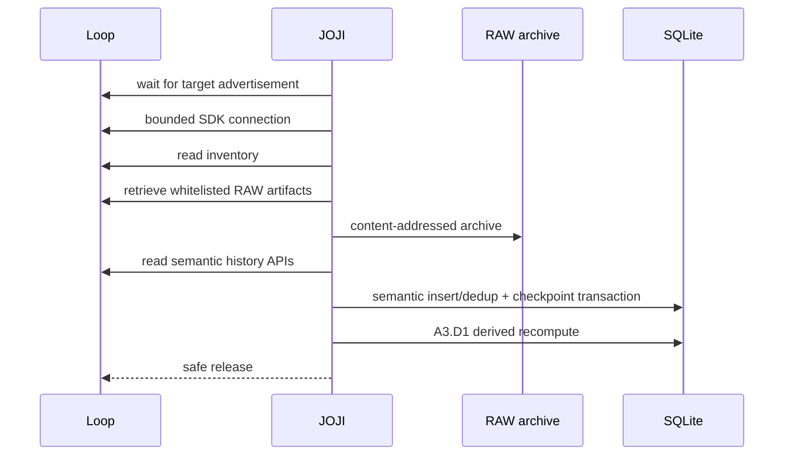

# Architecture

## Design goal

JOJI turns device and SDK observations into a durable local data model without collapsing raw evidence, canonical values, and derived analytics into one mutable record.

## Storage layers

### L0 — Evidence

- original SDK semantic payloads;
- whitelisted read-only RAW artifacts;
- SHA-256 identity for archived files;
- sync-session provenance.

### L1 — Canonical

Canonical records keep source authority explicit. For example, the current step count is sourced from the dedicated STEPS API, while DAILY_SUMMARY is preserved as an independent snapshot instead of silently overriding it.

### L2 — Derived

A3 introduces versioned derived daily metrics. Each derived result is associated with:

- date;
- algorithm version (`A3.D1`);
- source fingerprint;
- computation time;
- transparent metric payload.

If the source fingerprint changes, a new derived version is allowed. If it does not change, recompute deduplicates.

### L3 — Presentation

The product-facing information architecture is organized around:

`Overview · Sync · Health · History · Device · Advanced`

Legacy research surfaces remain available under Advanced rather than being deleted.

## Incremental sync model

## Dedup rules

Semantic records use a logical key plus payload SHA-256.

- same logical key + same payload → duplicate;
- same logical key + changed payload → preserve a new version.

RAW files are content-addressed and similarly retain changed versions without duplicating identical content.
