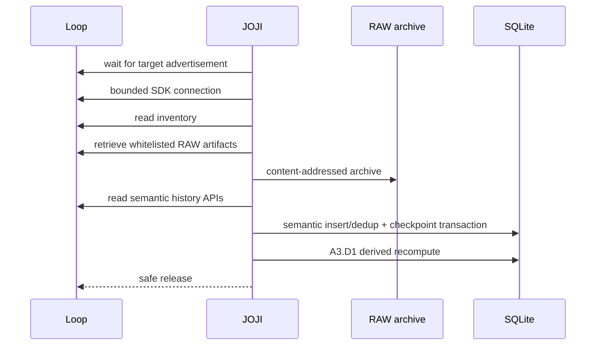

# 架构

[English](ARCHITECTURE.md) · **简体中文**

> [!NOTE]
> 本文描述的是 JOJI 当前实现/项目架构，不代表 Polar 内部架构。

## 设计目标

JOJI 将设备与 SDK 观察结果转化为可长期保存的本地数据模型，同时避免把 RAW evidence、Canonical 值和 Derived 分析结果压成一条可变记录。

## 存储分层

### L0 — Evidence

- 原始 SDK 语义 payload；
- whitelist 允许的只读 RAW 文件；
- 归档文件的 SHA-256 identity；
- sync session provenance。

### L1 — Canonical

Canonical 层明确保留 source authority。例如：当前步数以 dedicated STEPS API 为来源，而 DAILY_SUMMARY 作为独立 snapshot 保存，不会静默覆盖它。

### L2 — Derived

A3 引入版本化的每日派生指标。每条结果关联：

- 日期；
- 算法版本（`A3.D1`）；
- source fingerprint；
- 计算时间；
- 透明的 metric payload。

source fingerprint 变化时允许生成新版本；未变化时重算应去重。

### L3 — Presentation

面向产品的导航结构：

`Overview · Sync · Health · History · Device · Advanced`

旧研究页面保留在 Advanced 中，而不是直接删除。

## 增量同步模型

## 去重规则

Semantic records 使用 logical key + payload SHA-256：

- 同 logical key + 同 payload → duplicate；
- 同 logical key + payload 变化 → 保留新版本。

RAW 文件使用 content-addressed 归档，同样保留发生变化的版本，同时避免重复保存完全相同内容。
